# MLCC Manufacturing Process Analysis

## 1. Project Overview

This project presents an end-to-end analysis of MLCC manufacturing process data to evaluate process performance, product quality, variation, yield, and defect patterns. SQL was used for data querying, cleaning, transformation, integration, and analytical exploration, while Power BI was used for data modeling and interactive visualization to identify trends, process issues, and opportunities for quality and process improvement.

**Tools:** MySQL, SQL, Power BI, Power Query, DAX

---

## 2. Dashboard Overview

### Dashboard 1 — Manufacturing Overview

**What is happening overall?**

  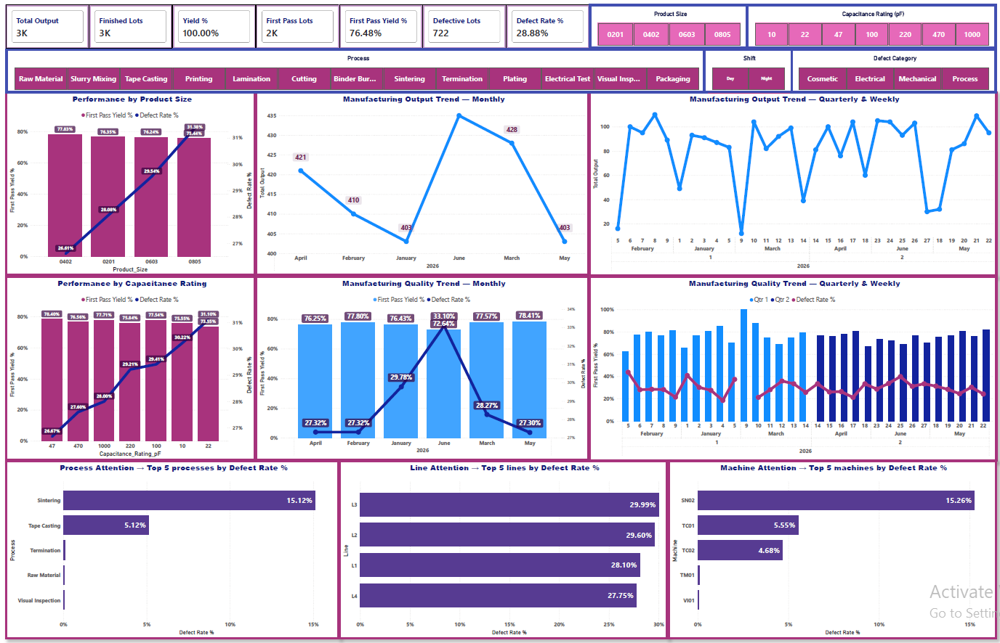

### Dashboard 2 — Yield & Defect Analysis

**Where are the losses, and what is driving them?**

  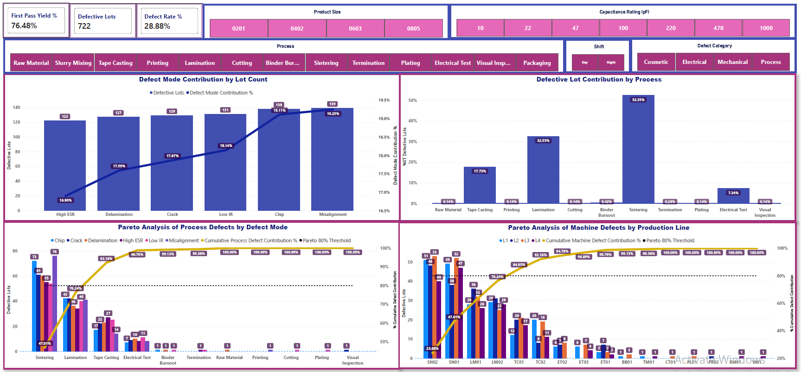

### Dashboard 3 — Process Performance & Diagnostics

**What process behavior or conditions may be driving the problems?**

  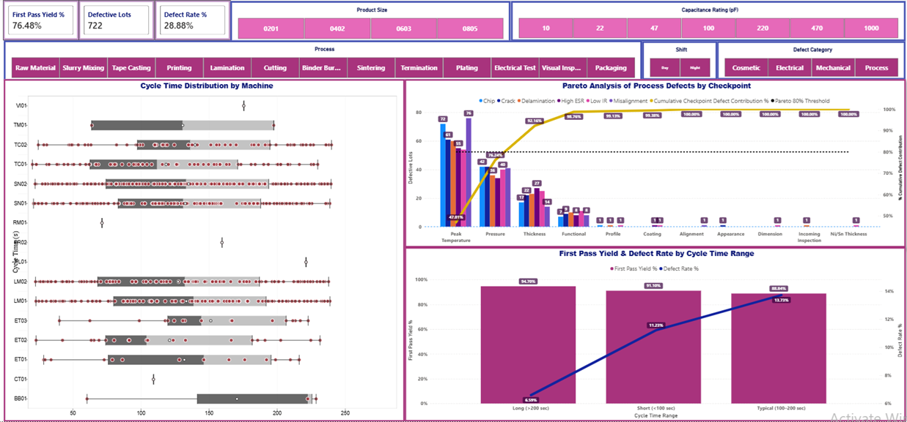

### Dashboard 4 — Product Quality & Process Capability

**Are products meeting specifications, and can manufacturing processes consistently maintain those requirements?**

  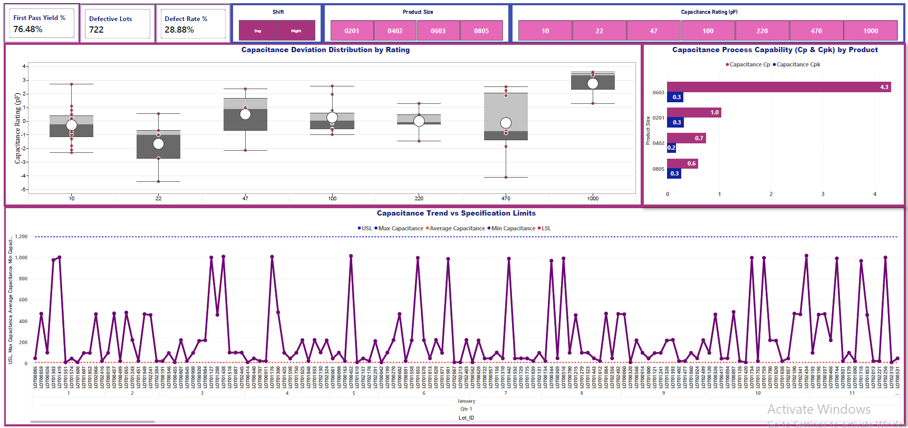

---

## 3. Questions

### Dashboard 1 — Manufacturing Overview

- What are the overall manufacturing output, yield, first-pass yield, and defect rate?
- How do first-pass yield and defect rate vary across product sizes and capacitance ratings?
- How do manufacturing output, first-pass yield, and defect rate change over time?
- Which products, processes, production lines, and machines require the most attention?

### Dashboard 2 — Yield & Defect Analysis

- Which defect modes contribute most to defective lots?
- Which manufacturing processes account for the majority of defective lots, and which defect modes drive them?
- Which machines account for the majority of defective lots, and which production lines do they belong to?
- How do defect patterns and priority areas change across product size, capacitance rating, process, production shift, and defect category?

### Dashboard 3 — Process Performance & Diagnostics

- How does cycle time vary across manufacturing processes, products, machines, and production shifts?
- At which manufacturing checkpoints are quality issues most concentrated?
- How is cycle-time range associated with first-pass yield and defect rate across manufacturing processes?

### Dashboard 4 — Product Quality & Process Capability

- Which products exhibit the greatest capacitance deviation and measurement variability?
- Which products and manufacturing processes demonstrate the strongest and weakest process capability?
- How do minimum, average, and maximum capacitance measurements vary over time relative to specification limits?

---

## 4. Data Preparation

| **Step** | **Description** |
|---|---|
| **Data Source** | Used raw MLCC manufacturing data containing production, product, process, machine, quality, defect, electrical measurement, yield, and disposition records. |
| **Data Cleaning** | Used SQL to inspect the raw manufacturing data, validate field contents and data types, and prepare the dataset for analysis. |
| **Data Transformation** | Used SQL to create analysis-ready fields and classifications required for manufacturing performance, quality, defect, and yield analysis. |
| **Data Integration** | Structured and connected the prepared manufacturing data with supporting tables for analysis and Power BI data modeling. |
| **Output** | Produced a structured, analysis-ready dataset for evaluating production output, yield, defects, process performance, product quality, variation, and manufacturing trends in Power BI. |

---

## 5. Data Validation

**Objective:** Verify that the First Pass Yield (FPY) and Total Quality Losses Pareto metrics displayed in the Power BI dashboard accurately match the source dataset.

**Validation:** Compared the Power BI results with Excel PivotTables using the distinct count of `Lot_ID`. FPY was validated by Product Size and Result (Pass, Fail, and Rework), while Total Quality Losses were validated by Process, Defect Mode, Defect Category, and Result (Fail and Rework).

**Result:** The FPY values and Total Quality Loss counts matched between Excel and Power BI, confirming that the dashboard calculations, defect distribution, and filter context accurately represent the underlying manufacturing data.

**Steps:**

1. Create Excel PivotTables from the manufacturing dataset using the distinct count of `Lot_ID`.
2. Validate FPY by comparing Product Size and Result (Pass, Fail, and Rework).
3. Validate Total Quality Losses by comparing Process, Defect Mode, Defect Category, and Result (Fail and Rework).
4. Compare the Excel results with the corresponding Power BI visuals.
5. Confirm that the FPY values, quality-loss counts, defect distributions, and Pareto results match across Excel and Power BI.

  

---

## 6. Dashboard & Statistical Analysis

| Dashboard / Analytical Visual | Question | Focus |
|---|---|---|
| **Dashboard 1 — Manufacturing Overview** | What is happening overall? | Provides an overall view of manufacturing performance, production volume, product quality, trends, and areas requiring attention. |
| **KPI Cards — Total Output, Finished Lots, Yield %, First Pass Lots, First Pass Yield %, Defective Lots, and Defect Rate %** | What are the overall manufacturing output, yield, first-pass yield, and defect rate? | Summarizes the key production and quality KPIs to establish the overall manufacturing performance baseline. |
| **Performance by Product Size and Capacitance Rating** | How do first-pass yield and defect rate vary across product sizes and capacitance ratings? | Compares quality performance across product configurations to identify groups associated with lower FPY or higher defect rates. |
| **Manufacturing Output and Quality Trends — Monthly, Quarterly, and Weekly** | How do manufacturing output, first-pass yield, and defect rate change over time? | Evaluates changes in production and quality performance to identify trends and periods requiring attention. |
| **Top 5 Processes, Lines, and Machines by Defect Rate** | Which products, processes, production lines, and machines require the most attention? | Identifies manufacturing areas with elevated defect rates to prioritize further investigation and improvement. |
| **Dashboard 2 — Yield & Defect Analysis** | Where are the losses, and what is driving them? | Investigates where manufacturing quality losses occur and identifies the primary contributors driving those losses. |
| **Defect Mode Contribution by Lot Count** | Which defect modes contribute most to defective lots? | Compares defective-lot contribution across defect modes to identify the most significant sources of quality loss. |
| **Defective Lot Contribution by Process and Process-Defect Pareto Analysis** | Which manufacturing processes account for the majority of defective lots, and which defect modes drive them? | Identifies processes contributing most to quality losses and determines the dominant defect modes driving those losses. |
| **Pareto Analysis of Machine Defects by Production Line** | Which machines account for the majority of defective lots, and which production lines do they belong to? | Identifies priority machines and their corresponding production lines based on their contribution to manufacturing quality losses. |
| **Dashboard Filters / Interactive Analysis** | How do defect patterns and priority areas change across product size, capacitance rating, process, production shift, and defect category? | Uses interactive filtering to determine how defect patterns and quality priorities change under different manufacturing conditions. |
| **Dashboard 3 — Process Performance & Diagnostics** | What process behavior or conditions may be driving the problems? | Investigates process behavior and manufacturing conditions that may be associated with quality losses and performance variation. |
| **Cycle-Time Distribution by Machine** | How does cycle time vary across manufacturing processes, products, machines, and production shifts? | Evaluates cycle-time distribution and variation across manufacturing conditions using interactive filters. |
| **Pareto Analysis of Process Defects by Checkpoint** | At which manufacturing checkpoints are quality issues most concentrated? | Identifies checkpoints with the greatest concentration of quality losses and the defect modes contributing to them. |
| **First-Pass Yield and Defect Rate by Cycle-Time Range** | How is cycle-time range associated with first-pass yield and defect rate across manufacturing processes? | Examines how FPY and defect rate change across cycle-time ranges to identify possible relationships between process duration and quality performance. |
| **Dashboard 4 — Product Quality & Process Capability** | Are products meeting specifications, and can manufacturing processes consistently maintain those requirements? | Evaluates product conformance, measurement variation, and manufacturing process capability relative to specification requirements. |
| **Capacitance Deviation Distribution by Rating** | Which products exhibit the greatest capacitance deviation and measurement variability? | Compares capacitance deviation distributions across products to identify those exhibiting greater measurement variation. |
| **Capacitance Process Capability (Cp and Cpk) by Product** | Which products and manufacturing processes demonstrate the strongest and weakest process capability? | Uses Cp and Cpk to evaluate and compare the ability of manufacturing processes to consistently meet capacitance specifications. |
| **Capacitance Trend vs. Specification Limits** | How do minimum, average, and maximum capacitance measurements vary over time relative to specification limits? | Tracks capacitance measurements over time against specification limits to identify shifts, variation, and potential conformance risks. |

---

## 7. Key Findings

### Dashboard 1 — Manufacturing Overview

| Question | Dashboard Visual | Conclusion |
|---|---|---|
| **What are the overall manufacturing output, yield, first-pass yield, and defect rate?** | 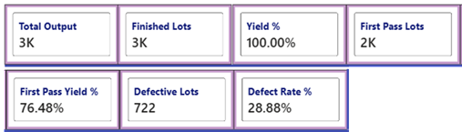 | The manufacturing dataset recorded approximately **3K total output** and **3K finished lots** with **100% yield**, while first-pass yield was **76.48%**. A total of **722 defective lots** were identified, with a **28.88% defect rate**, showing that although production completion was high, first-pass quality performance presents an opportunity for improvement. |
| **How do first-pass yield and defect rate vary across product sizes and capacitance ratings?** | 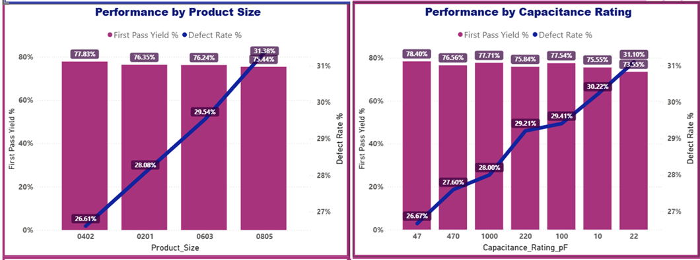 | First-pass yield remained relatively similar across product sizes at approximately **75–78%**, while defect rate showed greater variation. **0805** exhibited the lowest FPY and highest defect rate among the product sizes. Performance also varied across capacitance ratings, indicating that product configuration influences quality performance. |
| **How do manufacturing output, first-pass yield, and defect rate change over time?** | 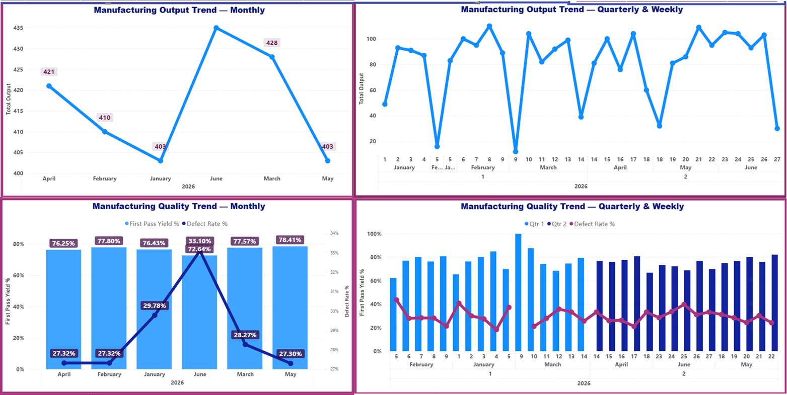 | Manufacturing output fluctuated moderately across months and production weeks, while FPY and defect rate exhibited more noticeable short-term variation. Production volume remained comparatively stable, whereas quality performance changed across periods and should be monitored independently of output. |
| **Which products, processes, production lines, and machines require the most attention?** | 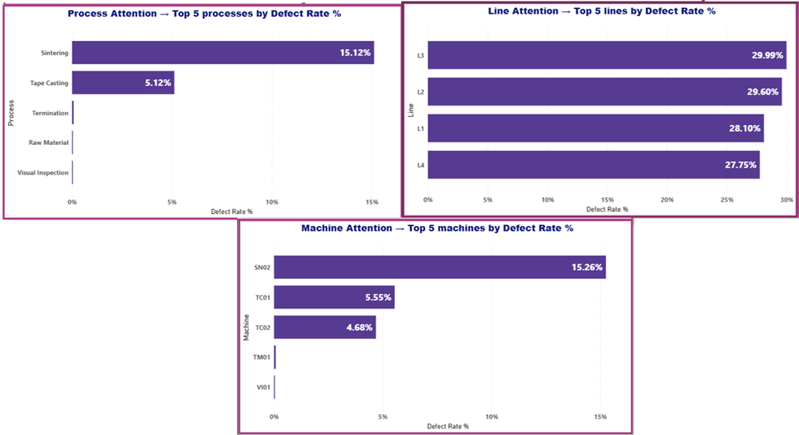 | Quality losses were not distributed evenly across manufacturing operations. **Sintering** showed the highest process defect rate, while specific production lines and machines also exhibited elevated defect rates, providing clear priority areas for deeper process investigation and improvement. |

### Dashboard 2 — Yield & Defect Analysis

| Question | Dashboard Visual | Conclusion |
|---|---|---|
| **Which defect modes contribute most to defective lots?** | 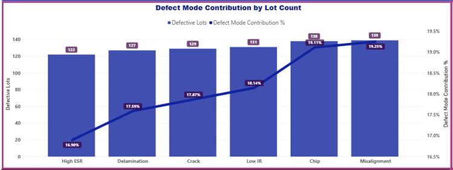 | Defective lots were distributed across several recurring defect modes, with **Misalignment, Chip, Low IR, Crack, Delamination, and High ESR** representing the primary quality-loss categories. Their contributions were relatively close, indicating that manufacturing losses were driven by multiple defect mechanisms rather than a single dominant defect mode. |
| **Which manufacturing processes account for the majority of defective lots, and which defect modes drive them?** | 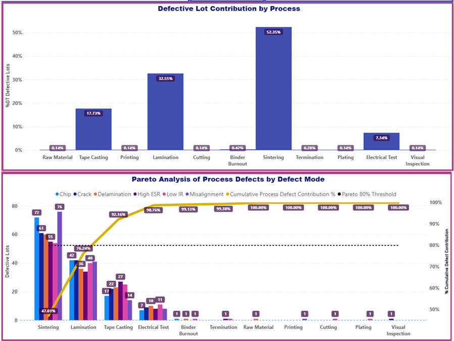 | **Sintering** was the dominant contributor to defective lots, followed by **Lamination, Tape Casting, and Electrical Test**. The Pareto analysis further showed that multiple defect modes contribute within these processes, allowing improvement efforts to focus first on the processes responsible for most quality losses and then on their dominant failure mechanisms. |
| **Which machines account for the majority of defective lots, and which production lines do they belong to?** | 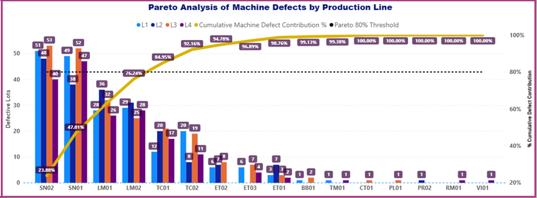 | Defective lots were concentrated among a smaller group of machines and their associated production lines. The Pareto analysis identifies these machine-line combinations as priority targets for equipment- and process-level investigation rather than treating all machines as equally influential. |
| **How do defect patterns and priority areas change across product size, capacitance rating, process, production shift, and defect category?** | 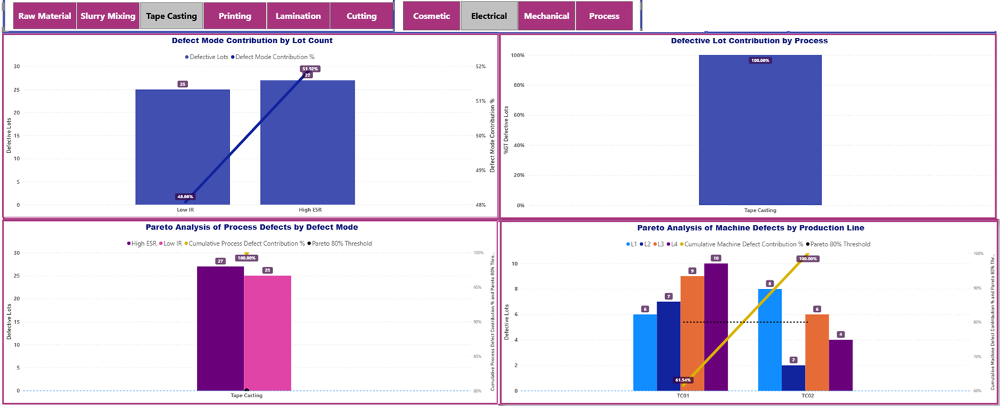 | Interactive filtering enables broad quality-loss patterns to be narrowed to specific product and operating conditions. In the selected drill-down, **52 defective lots** were concentrated entirely in **Tape Casting** and divided almost evenly between **High ESR (27 lots)** and **Low IR (25 lots)**. Machine-level analysis further localized the defects to **TC01 and TC02**, providing a focused scope for root-cause investigation. |

### Dashboard 3 — Process Performance & Diagnostics

| Question | Dashboard Visual | Conclusion |
|---|---|---|
| **How does cycle time vary across manufacturing processes, products, machines, and production shifts?** | 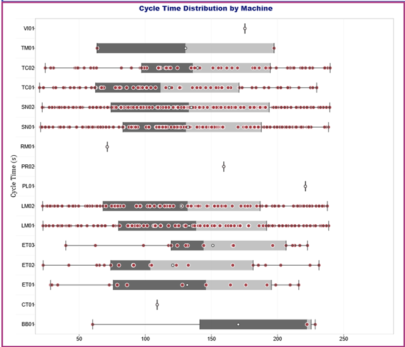 | Cycle-time distributions showed different levels of variability across machines and operating conditions within manufacturing processes. While differences in typical cycle time between processes are expected due to different processing requirements, unusually wide distributions and extreme observations within comparable process conditions may indicate inconsistent process behavior and warrant further investigation. |
| **At which manufacturing checkpoints are quality issues most concentrated?** | 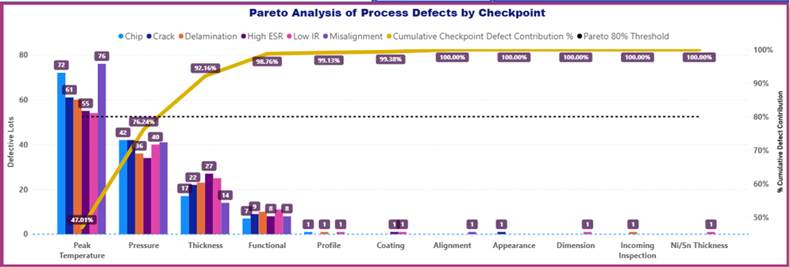 | Quality losses were strongly concentrated at a limited number of checkpoints. **Peak Temperature** and **Pressure** represented major contributors, followed by **Thickness**, while the remaining checkpoints contributed substantially fewer defective lots. This provides a clear basis for prioritizing process-control investigation at the highest-loss checkpoints. |
| **How is cycle-time range associated with first-pass yield and defect rate across manufacturing processes?** | 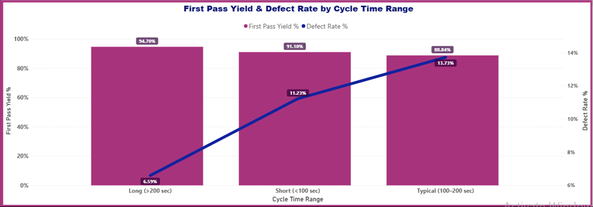 | First-pass yield and defect rate changed across cycle-time ranges, indicating an association between process duration and quality performance. The relationship should be treated as a diagnostic signal rather than evidence of causation, with process-specific investigation required to determine whether cycle time itself or related operating conditions are driving the observed differences. |

### Dashboard 4 — Product Quality & Process Capability

| Question | Dashboard Visual | Conclusion |
|---|---|---|
| **Which products exhibit the greatest capacitance deviation and measurement variability?** | 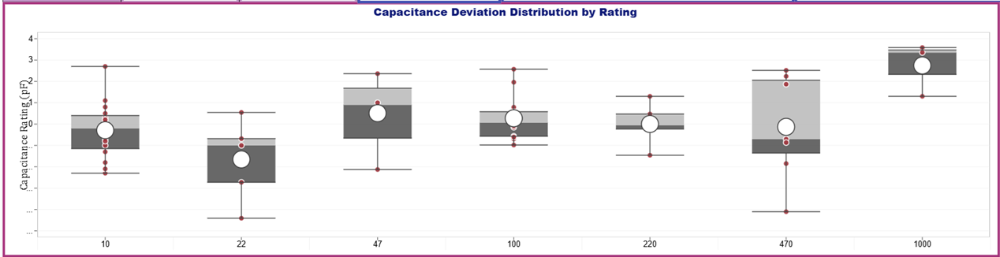 | Capacitance deviation distributions varied across product ratings, with some products showing greater relative dispersion and more extreme deviations from their nominal values. Because nominal capacitance and specification limits differ across product configurations, quality performance should be evaluated relative to each product's applicable rating and tolerance rather than by comparing raw capacitance measurements directly. |
| **Which products and manufacturing processes demonstrate the strongest and weakest process capability?** | 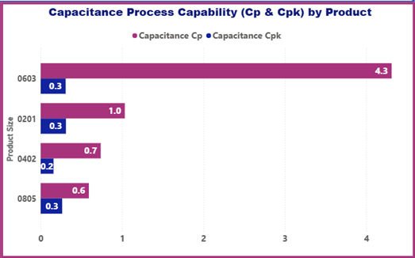 | Process capability differed substantially across products. The gap between **Cp and Cpk** for several products indicates that potential process capability may be considerably better than actual performance, suggesting that process centering, rather than variation alone, is an important contributor to reduced capability. |
| **How do minimum, average, and maximum capacitance measurements vary over time relative to specification limits?** | 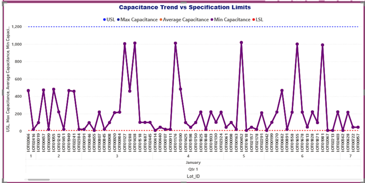 | Capacitance measurements varied over time across product configurations. Because specification limits differ by capacitance rating and product size, temporal trends should be evaluated within comparable product configurations and against their applicable **LSL and USL**. Monitoring minimum, average, and maximum measurements over time can help identify shifts toward specification boundaries and potential conformance risk. |

---

## 8. Recommendations

| Recommendation | Rationale |
|---|---|
| **Prioritize Sintering for defect-reduction and process-improvement investigation.** | Sintering showed the highest process defect rate and was the largest contributor to defective lots, making it the strongest overall process-level priority identified in the analysis. |
| **Target the major recurring defect modes within their respective manufacturing processes.** | Misalignment, Chip, Low IR, Crack, Delamination, and High ESR were the primary defect modes, with no single mode dominating overall losses. Process-specific investigation is therefore more appropriate than applying one corrective action across all defects. |
| **Prioritize high-defect machines and their associated production lines for targeted investigation.** | Defective lots were concentrated among a smaller group of machines and production lines, providing specific equipment-level targets for root-cause analysis and corrective action. |
| **Strengthen process-control investigation at Peak Temperature, Pressure, and Thickness checkpoints.** | These checkpoints accounted for a substantial portion of quality losses, with Peak Temperature and Pressure representing the strongest checkpoint-level priorities. |
| **Investigate abnormal cycle-time variation within comparable process conditions.** | Different manufacturing processes naturally require different cycle times; attention should focus on unusually wide distributions or extreme observations among comparable machines, products, shifts, and process conditions rather than absolute differences between processes. |
| **Investigate process-specific cycle-time ranges associated with lower FPY or higher defect rates.** | Quality performance changed across cycle-time ranges. These patterns should be used as diagnostic signals to identify processes requiring deeper investigation, while avoiding assumptions that cycle time itself is the direct cause. |
| **Evaluate capacitance stability within comparable product configurations rather than across different ratings.** | Capacitance ratings and specification limits naturally differ across products. Products showing greater relative deviation or dispersion within the same applicable configuration should receive greater process-control attention. |
| **Prioritize process-centering improvement for product configurations showing large Cp–Cpk gaps.** | Large differences between Cp and Cpk indicate that potential capability may be stronger than actual capability, suggesting that process centering should be investigated before focusing solely on reducing variation. |
| **Monitor capacitance trends within individual product configurations against their applicable LSL and USL.** | Minimum, average, and maximum measurements can detect movement toward specification boundaries, but trends should be evaluated within comparable capacitance ratings and product sizes because their specification ranges differ. |
| **Use interactive drill-down analysis to define targeted root-cause investigations.** | Filtering by product size, capacitance rating, process, shift, defect category, line, and machine can narrow broad quality losses to specific operating conditions, as demonstrated by the Tape Casting drill-down example. |

---

## 9. Skills Demonstrated

| Skill Area | Tools / Techniques |
|---|---|
| **Data Preparation** | SQL Data Inspection, Data Type Validation, Data Structure Validation |
| **Data Transformation** | SQL, CASE Statements, Date Functions, String Functions, Calculated / Derived Fields |
| **Data Integration** | Relational Table Integration, Process and Specification Data Integration |
| **SQL Querying** | SELECT, WHERE, GROUP BY, HAVING, Aggregate Functions, CASE, Date / String Functions |
| **Data Modeling** | Power BI Data Model, Table Relationships, DAX Measures, Calculated Columns |
| **Data Validation** | Excel PivotTables, Distinct Count Validation, Source-to-Dashboard Reconciliation, First-Pass Yield Verification, Quality Loss / Pareto Verification |
| **Data Analysis** | Manufacturing Performance Analysis, Yield and First-Pass Yield Analysis, Defect and Quality Loss Analysis, Pareto Analysis, Product Performance Analysis, Process Performance Analysis, Machine and Production Line Analysis, Cycle-Time Analysis, Checkpoint Analysis, Capacitance Deviation Analysis, Process Capability Analysis (Cp and Cpk), Time-Trend Analysis |
| **Data Visualization** | Power BI Dashboards, KPI Cards, Line Charts, Bar / Column Charts, Combo Charts, Pareto Charts, Box-and-Whisker Plot, Reference / Specification Lines, Slicers, Interactive Filtering / Cross-filtering |
